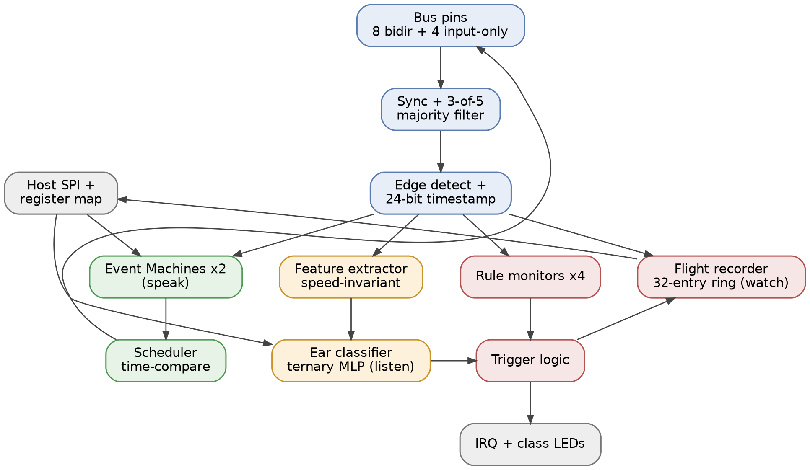

   

# Shruti: an event-native protocol emulator ASIC that also listens

Shruti (Sanskrit: "that which is heard") is an open-source protocol emulator chip for Tiny Tapeout (IHP 130nm CMOS5L, 6x4 tiles), built for the [Jane Street protocol emulator ASIC competition](https://blog.janestreet.com/protocol-emulator-asic-competition/). It speaks UART, SPI and I2C from firmware, and it listens: an on-die ternary classifier identifies an unknown bus from its edge timing, flags traffic it does not recognise, and can be retrained after fabrication.

**Target** Tiny Tapeout 6x4, IHP 130nm CMOS5L · **Clock** 50 MHz (40 or 60 MHz if Ethernet is attempted), 24 MHz fallback · **Logic** ~10,900 cells, estimated pre-synthesis, flip-flops only · **Submission** 12 Jan 2027 for the 18 Jan deadline · **Licence** Apache-2.0

Full design: [docs/architecture-spec.md](docs/architecture-spec.md).



## One idea

A single hardware stream of filtered, timestamped pin edges (20 ns resolution) fans out to three consumers: Event Machines (firmware that speaks), Watch (rule monitors and a flight recorder that check), and the Ear (a learned model that identifies). Only the scheduler drives pins; only the host loads programs and weights.

## What we do differently from PIO

The RP2040's PIO is cycle-exact, but its timing is relative to its own instruction stream: a response to an input edge lands however many instructions later the program takes to react, and that varies with the code path. Shruti anchors every timing-critical instruction to T, the hardware timestamp of the last matched edge, so a response lands at T+d whatever the path. The lineage is the channel time latches of NXP's eTPU. Three instructions PIO has no equivalent for:

1. `WAIT pin, edge, timeout`: blocks until the edge or a hardware timeout counted from T. Needed for CAN arbitration, I2C clock stretching and USB turnaround.
2. `IN pin @ T+d`: hardware samples the pin at a computed future time, so a mid-bit read is one instruction.
3. Edge-latched snapshot: all 12 watchable pins are latched as they stood at the matched edge, so a slave reads data at the clock edge, not several cycles later.

Two Event Machines, 16-bit instructions, 32 words each. Measured on the simulator: UART transmit is 12 words, UART receive 17, SPI master 19, SPI slave 18 and I2C master 32.

## The Ear: identify, flag, learn

Hardware compresses a 256-edge window into 72 speed-invariant features: log2-domain interval ratios normalised to the shortest interval seen, plus pair timing between pins, with the pins sorted by activity so the wiring does not matter; a 9600-baud UART and a 1-Mbaud UART produce the same interval histogram. A host-loaded ternary MLP (640 weights and 8 thresholds, 1,344 bits, 648 cycles per inference) reports a class on three LED pins, a confidence flag and an out-of-distribution flag. It identifies the protocols it was trained on, flags the rest as unknown, and learns new ones through a closed loop: `shruti teach` captures feature snapshots from the chip, `shruti train` fits a new ternary model (working today on simulated buses; accuracy in ear/REPORT.md), `shruti load` writes the weights over SPI. No re-spin. The per-pin shortest-interval code doubles as a bus-speed estimate with no ML at all.

## Watch: a protocol trigger with a flight recorder

Four host-configured rule monitors match an edge, a guard over the pin snapshot and interval bounds, for example "SPI data edge within one cycle of the sampling clock edge". Any rule, the Ear's unknown flag or a trigger-in pin freezes a 32-event pre-trigger ring buffer, raises IRQ and drives trigger-out for a scope. Rules catch the violation you can name; the Ear catches the traffic you cannot. Watch observes only; nothing in Shruti alters the bus.

## Proof-carrying firmware

Every protocol program ships with a machine-checked proof that it meets its contract. `shruti prove` symbolically executes the ISS over the program with the data bytes and the bit period left symbolic and hands the arithmetic to Z3; a proof or a counterexample trace comes back in seconds, and `shruti load` refuses an unproven program. The RTL is tied to the ISS by bounded formal equivalence and differential testing. So an LLM can write the firmware for a new protocol and nobody has to read it: the prover accepts or rejects. Nobody proves PIO programs; Shruti's are small enough to prove.

## Stretch: 10 Mbit Ethernet

The Event Machines cannot issue an instruction per half-bit at 10 Mbit/s, so Ethernet transmit is a ~150-cell hardware Manchester serializer fed from the OSR, with the host supplying preamble and CRC32. A link pulse every 16 ms lights a switch's LED; one ARP or ICMP frame shows up in tcpdump on a laptop. Receive is a further stretch on DDR edge capture (10 ns timestamps, fully synchronous). Ethernet needs whole-cycle bit periods, so it means a 40 or 60 MHz core, settled in week one.

## Silicon realities

- I/O: all 24 Tiny Tapeout signals. 8 bidirectional bus pins (`uio`) with per-pin open-drain mode for I2C and 1-Wire (CAN goes through an external transceiver), 4 input-only monitor pins, a 3-wire host SPI, trigger-in, and outputs for MISO, IRQ, trigger-out, the class LEDs and the two flags. The demo board's RP2040 is the host.
- Memory first: about 5,000 bits of state, all in flip-flops; ~10,900 cells estimated against ~14,400 usable (24 tiles at ~1,000 cells, 60% utilisation). An SRAM macro is optional, used only if a macro of at least 4 kbit fits in 3 tiles or fewer including keep-out, checked in week one. Flops are the safe path for a first tapeout.
- Glitch filter: per pin, fully synchronous, configurable (bypass, 2-of-3 or 3-of-5 majority). 3-of-5 rejects pulses under 60 ns at 50 MHz and suits buses up to a few MHz; faster clocks use 2-of-3 or bypass. No analog delay lines: nothing to calibrate, and it can be formally checked.

## Verification

Alongside proof-carrying firmware, the distinctive claim is a formal proof in SymbiYosys that the on-die serial MAC and decision logic compute exactly what the exported integer reference model computes, for every weight set and feature vector (k-induction over the MAC counter, SAT equivalence for argmax and thresholds); the reference is itself checked against the training pipeline's model on the dataset. Around it: a cycle-accurate Python ISS written before any RTL, constrained-random differential testing of RTL against the ISS, protocol-level cocotb bus models with mutation tests, formal properties on the scheduler (fires at exactly T+d, never earlier, never twice), edge capture (no loss while an EM waits) and FIFOs (no silent overflow), an LLM red team whose bug yield is measured and reported per method, gate-level simulation after place-and-route, and an FPGA prototype (Tang Nano 20K) proven against a USB-UART adapter, SPI flash and an I2C sensor.

## Status

Spec v1.0: 23 Sep 2026, with the ISA reconciled to v1.1 (`docs/isa-decisions.md`). Milestone 0 in `src/`: synchronisers, selectable glitch filter and edge strobes, through the CMOS5L flow.

Working today, all in Python, with tests (`python -m pytest`):
- the cycle-accurate ISS (`iss/`), generated from `isa/isa.yaml`;
- the assembler and disassembler (`asm/`), round-trip checked over all 65,536 words;
- firmware (`fw/`), each tested against a model of the peer device: UART transmit and receive, SPI master and slave, I2C master;
- `shruti prove` (`prove/`): contracts proved for UART transmit (any number of frames), UART receive, SPI master and I2C master, with counterexamples replayed on the ISS where a peer model exists;
- the Ear (`ear/`): a bit-exact reference checked against the RTL's input path, a protocol simulator, and a first trained model (`ear/REPORT.md`, simulated buses only).

Next: RTL for the Event Machines once the language is chosen (11 Oct), the Ear RTL, then integration (29 Nov), FPGA bring-up in December, feature freeze 20 Dec and submission 12 Jan 2027. Built in public in this repo.

## Repository layout

| Path | Contents |
| --- | --- |
| `docs/` | Architecture spec, block diagram, Tiny Tapeout datasheet text (`info.md`) |
| `isa/` | The instruction set as data: `isa.yaml` is the single source of truth for the ISS, the assembler and the RTL |
| `iss/` | Cycle-accurate Python instruction-set simulator (golden model) |
| `asm/` | Assembler and disassembler |
| `prove/` | Protocol contracts and the Z3-based prover (`shruti prove`) |
| `fw/` | Firmware library: UART, SPI, I2C first, with their contracts |
| `ear/` | Feature-extractor reference model, training pipeline, weight export |
| `verify/` | cocotb bus models, formal properties (SymbiYosys), differential test harness |
| `fpga/` | Tang Nano 20K prototype |
| `src/`, `test/` | Tiny Tapeout RTL and cocotb tests (what the GDS and test actions build) |

## Build and test

```
cd test && make            # RTL simulation with Icarus Verilog + cocotb
cd test && make GATES=yes  # gate-level simulation after the GDS action has run
```

The GitHub Actions in `.github/workflows` run the tests, the LibreLane flow to GDS, the Tiny Tapeout precheck and the datasheet build on every push.
