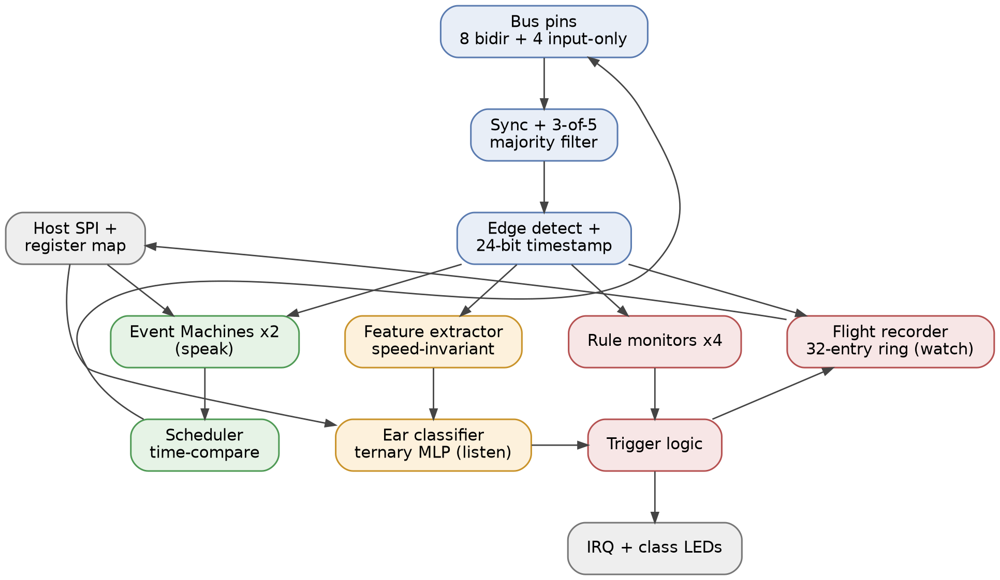

   

# Shruti: an event-native protocol emulator ASIC that also listens

Shruti (Sanskrit: "that which is heard") is an open-source protocol emulator chip for Tiny Tapeout (IHP 130nm CMOS5L, 6x4 tiles), built for the [Jane Street protocol emulator ASIC competition](https://blog.janestreet.com/protocol-emulator-asic-competition/). It speaks UART, SPI and I2C from firmware, and it listens: an on-die ternary classifier names a bus it was trained on from its edge timing, says when it is confident, and can be retrained after fabrication.

**Target** Tiny Tapeout 6x4, IHP 130nm CMOS5L · **Clock** 50 MHz (40 or 60 MHz if Ethernet is attempted), 24 MHz fallback · **Logic** 27,789 cells and 4,396 flip-flops synthesised, 68.6% placed utilisation, timing met at 50 MHz (commit fcafc0b; Watch not yet in), flip-flops only · **Submission** 12 Jan 2027 for the 18 Jan deadline · **Licence** Apache-2.0

Full design: [docs/architecture-spec.md](docs/architecture-spec.md).



## One idea

A single hardware stream of filtered, timestamped pin edges (20 ns resolution) fans out to three consumers: Event Machines (firmware that speaks), Watch (rule monitors and a flight recorder that check), and the Ear (a learned model that identifies). Only the scheduler drives pins; only the host loads programs and weights.

## What we do differently from PIO

The RP2040's PIO is cycle-exact, but its timing is relative to its own instruction stream: a response to an input edge lands however many instructions later the program takes to react, and that varies with the code path. Shruti anchors every timing-critical instruction to T, the hardware timestamp of the last matched edge, so a response lands at T+d whatever the path. The lineage is the channel time latches of NXP's eTPU. Three instructions PIO has no equivalent for:

1. `WAIT pin, edge, timeout`: blocks until the edge or a hardware timeout counted from T. Needed for CAN arbitration, I2C clock stretching and USB turnaround.
2. `IN pin @ T+d`: hardware samples the pin at a computed future time, so a mid-bit read is one instruction.
3. Edge-latched snapshot: all 12 watchable pins are latched as they stood at the matched edge, so a slave reads data at the clock edge, not several cycles later.

Two Event Machines, 16-bit instructions, 32 words each. Measured on the simulator: UART transmit is 12 words, UART receive 17, SPI master 19, SPI slave 18 (15 with CPHA = 1), I2C master 32 and I2C target 32.

## The Ear: identify, abstain, learn

Hardware compresses a 256-edge window into 72 speed-invariant features: log2-domain interval ratios normalised to the shortest interval seen, plus pair timing between pins, with the pins sorted by activity so the wiring does not matter; a 9600-baud UART and a 1-Mbaud UART produce the same interval histogram. (That holds for the features; at 9,600 baud a 1.3 ms window holds only about 6 edges, so today the activity gate flags almost every window. See Known limitations.) A host-loaded ternary MLP (640 weights and 8 thresholds, 1,344 bits, 648 cycles per inference) reports a class on three LED pins, a confidence flag and an out-of-distribution flag. It identifies the protocols it was trained on and sets a confident flag when it is sure: on simulated buses the class is right 99.5% of the time the flag is set. Flagging traffic it was never trained on does not work yet (Known limitations). New protocols are learned through a closed loop: `shruti teach` captures feature snapshots from the chip (planned; the RTL's HOLD-mode readback it needs exists), `shruti train` fits a new ternary model (working today on simulated buses; ear/REPORT.md), and `shruti load` writes the weights over SPI (planned). No re-spin. The per-pin shortest-interval code doubles as a bus-speed estimate with no ML at all.

## Watch: a protocol trigger with a flight recorder

**Planned, not built yet.** The first build is the cut level (2 monitors, a 16-entry recorder), grown only if place-and-route leaves room. The design:

Four host-configured rule monitors match an edge, a guard over the pin snapshot and interval bounds, for example "SPI data edge within one cycle of the sampling clock edge". Any rule, the Ear's unknown flag or a trigger-in pin freezes a 32-event pre-trigger ring buffer, raises IRQ and drives trigger-out for a scope. Rules catch the violation you can name; the Ear is meant to catch the traffic you cannot, though its unknown flag does not do that reliably yet (Known limitations). Watch observes only; nothing in Shruti alters the bus.

## Proof-carrying firmware

Every protocol program is meant to ship with a machine-checked proof that it meets its contract; today UART transmit and receive, SPI master and I2C master do, and the SPI slave and I2C target are tested but not yet proved. `shruti prove` symbolically executes the ISS over the program with the data bytes and the bit period left symbolic and hands the arithmetic to Z3; a proof or a counterexample trace comes back in seconds, and `shruti load` will refuse an unproven program (planned; the CLI has `prove` and `train` today). The RTL is tied to the ISS by cycle-exact differential testing and by 27 SymbiYosys properties of the Event Machine; a bounded formal equivalence check against a transliteration of the ISS is planned. The aim is that an LLM writes the firmware for a new protocol and nobody has to read it, because the prover accepts or rejects it; that demo is planned for 20 Dec. Nobody proves PIO programs; Shruti's are small enough to prove.

## Stretch: 10 Mbit Ethernet

The Event Machines cannot issue an instruction per half-bit at 10 Mbit/s, so Ethernet transmit is a ~150-cell hardware Manchester serializer fed from the OSR, with the host supplying preamble and CRC32. A link pulse every 16 ms lights a switch's LED; one ARP or ICMP frame shows up in tcpdump on a laptop. Receive is a further stretch on DDR edge capture (10 ns timestamps, fully synchronous). Ethernet needs whole-cycle bit periods, so it means a 40 or 60 MHz core, settled in week one.

## Silicon realities

- I/O: all 24 Tiny Tapeout signals. 8 bidirectional bus pins (`uio`) with per-pin open-drain mode for I2C and 1-Wire (CAN goes through an external transceiver), 4 input-only monitor pins, a 3-wire host SPI, trigger-in, and outputs for MISO, IRQ, trigger-out, the class LEDs and the two flags. The demo board's RP2040 is the host.
- Memory first: all state in flip-flops. Measured at commit fcafc0b: 4,396 flip-flops and 27,789 cells synthesised for the Event Machines, program memory, input path, host SPI and the Ear; 619,342 um2 of cells, 68.6% of the 6x4 core after placement, with 50 MHz met at all corners. Watch has to fit in the rest. IHP SRAM macros are allowed and can be powered on Metal4 (spec section 8); putting the Ear's weights and Watch's recorder in macros is planned and will be measured on a GDS run.
- Glitch filter: per pin, fully synchronous, configurable (bypass, 2-of-3 or 3-of-5 majority). 3-of-5 rejects pulses under 60 ns at 50 MHz and suits buses up to a few MHz; faster clocks use 2-of-3 or bypass. No analog delay lines: nothing to calibrate, and it can be formally checked.

## Verification

The distinctive claim, planned for 13 Dec, is a formal proof in SymbiYosys that the on-die serial MAC and decision logic compute exactly what the exported integer reference model computes, for every weight set and feature vector (k-induction over the MAC counter, SAT equivalence for argmax and thresholds). What runs today, on every push:
- a cycle-accurate Python ISS written before any RTL, and cycle-exact differential testing of the RTL against it on random programs;
- 27 SymbiYosys properties of the Event Machine, proved by k-induction: an armed slot fires at exactly T+d, never earlier, never twice; LATE as the ISA defines it; WAIT timeouts; no silent FIFO overflow or underflow; PC and HALT. Each one fails on at least one of 31 planted bugs (`verify/README.md`);
- bit-exact checks of the Ear's RTL against its Python reference, window by window;
- mutation tests of the RTL test suite and of the formal properties, counted apart from real bugs (`docs/verification-log.md`);
- gate-level simulation of the routed netlist, and a signoff gate on post-route timing, DRC and antenna metrics.

Planned: protocol-level cocotb bus models with mutation tests, formal properties for edge capture (no edge lost while an EM waits) and the flight recorder, an LLM red team whose bug yield is measured and reported per method, and an FPGA prototype (Tang Nano 20K) run against a USB-UART adapter, an SPI flash and an I2C sensor.

## Status

Spec v1.0: 23 Sep 2026, with the ISA reconciled to v1.1 (`docs/isa-decisions.md`). RTL in Verilog.

### Built and tested (as of commit df5096b, 10 Oct 2026)

Every line names its evidence; the GitHub Actions in `.github/workflows` run all of it on every push.
- **Event Machines** (two), the 24-bit timestamp counter, the 12-pin input path with its glitch filter, the pin drivers and the host SPI (`src/`, `docs/host-interface.md`). They match the ISS in every register, FIFO and pin, every cycle, over 60 random two-EM programs with random pins and host traffic (`test/test.py`: `event_machines_match_the_iss`), plus directed FIFO corner tests (`tx_fifo_write_in_the_cycle_of_a_pull`, `rx_fifo_two_byte_push_wraps`, `rx_fifo_read_in_the_cycle_after_a_push`) and the input path against its reference (`input_path_matches_reference_model`, `glitch_filter_modes`).
- **27 formal properties of the Event Machine**, proved by k-induction, each failed by at least one of 31 planted bugs (`verify/README.md`, `formal` workflow).
- **UART out of a pin:** `fw/uart_tx.s`, loaded and started over SPI, sends bytes out of B0, checked against the ISS (`uart_tx_out_of_a_pin`).
- **The Ear in RTL:** 72 features, canonical pin order, a ternary 72-8-8 MLP, the weight ring and HOLD-mode readback. Bit-exact to `ear/features.py` and `ear/mlp.py` in class, flags and their timing on every window, and in all 72 features read back over SPI (`test/test.py`, the tests starting `ear_`).
- **Gate level:** the cocotb tests on the routed netlist, 11 passing and 2 RTL-only skipped (`gl_test` job).
- **Physical:** 50 MHz met at all three corners, slow-corner setup slack +4.24 ns, 68.6% utilisation, 0 DRC and 0 antenna violations, precheck passing (commit fcafc0b, spec section 8). The `signoff` job fails the build on negative slack, DRC, antenna or LVS errors (`verify/signoff.py`).
- **ISS** (`iss/`), generated from `isa/isa.yaml`: every instruction and scheduler rule (`iss/tests`).
- **Assembler and disassembler** (`asm/`): round trip over all 65,536 words; conditional assembly and `-D` overrides, so one source builds every SPI mode.
- **Firmware** (`fw/`): UART transmit and receive, SPI master and slave in each of modes 0-3, I2C master at 100 and 400 kHz, and an I2C target that receives writes (the host answers each ACK), each tested on the ISS against a model of the peer device, with injected faults (`fw/tests`).
- **Proofs** (`prove/`, `python -m shruti prove`): UART transmit (any number of frames), UART receive, SPI master (each of modes 0-3) and I2C master (standard and fast builds) against their contracts, with counterexamples replayed on the ISS.
- **Ear training and evaluation** (`ear/`): the bit-exact reference, the protocol simulator, a trained model (86.6% test accuracy on simulated buses, 99.5% when confident) and its evaluation in `ear/REPORT.md` (coverage by speed, foreign signals, held-out classes, float against integer; `ear/evaluate.py`).

### Planned

Dates from the spec's milestones:
- Watch at the cut level (2 monitors, a 16-entry recorder), then integration: checkpoint 29 Nov 2026.
- FPGA bring-up on a Tang Nano 20K against a USB-UART adapter, an SPI flash and an I2C sensor: 6 Dec 2026.
- The classifier proof; formal properties for edge capture and the recorder; a bounded equivalence check of the Event Machine against an ISS transliteration: 13 Dec 2026.
- A prescaler for the Ear's timebase so slow buses get answers, and better training for fast UARTs: before the feature freeze, 20 Dec 2026.
- `shruti teach` and `shruti load` (which refuses unproven programs), proofs for the SPI slave and the I2C target, and the "LLM writes PS/2 firmware, the prover accepts it" demo: 20 Dec 2026; demos count only if passing by then.
- The measured LLM red team (mutations and candidate properties proposed from the ISA, bug yield reported per method): in the verification report, 12 Jan 2027.
- An I2C target that can be read as well as written: the write target fills 32 words, so reads need their own program or the 64-word option: before the feature freeze, 20 Dec 2026.
- Low-speed USB and the Ethernet stretch: only if passing by 20 Dec 2026.

### Known limitations

On simulated buses with the shipped weights (`ear/REPORT.md`):
- **Slow buses get no answer.** A window closes after 65,536 cycles (1.3 ms), so a UART at 19,200 baud or slower has at most about 11 edges per window and 96-100% of its windows are flagged; PS/2 is answered on 34-39% of windows.
- **Fast UARTs are called CAN.** From 115,200 baud up, 84-95% of answered UART windows are classified CAN, the 0-3% that are confident are all wrong, and no UART window at any speed is confidently right.
- **The out-of-distribution flag misses foreign traffic.** A 20 kHz PWM, WS2812 LED data and random edges on four pins are flagged on 0% of windows and called CAN, Manchester and JTAG/SWD; read the class only with the confident flag, which fired on none of them except WS2812 with the unused pins idle low (6%).
- **Held-out protocols are not flagged either.** A model trained without JTAG/SWD and PS/2 flags none of their windows; it abstains on every PS/2 window but confidently calls 43% of JTAG/SWD windows SPI.

## Repository layout

| Path | Contents |
| --- | --- |
| `docs/` | Architecture spec, block diagram, Tiny Tapeout datasheet text (`info.md`) |
| `isa/` | The instruction set as data: `isa.yaml` is the single source of truth for the ISS, the assembler and the RTL |
| `iss/` | Cycle-accurate Python instruction-set simulator (golden model) |
| `asm/` | Assembler and disassembler |
| `prove/` | Protocol contracts and the Z3-based prover (`shruti prove`) |
| `fw/` | Firmware library: UART, SPI, I2C first, with their contracts |
| `ear/` | Feature-extractor reference model, training pipeline, weight export, evaluation |
| `verify/` | Formal properties (SymbiYosys), planted-bug runs, the CI signoff gate |
| `fpga/` | Tang Nano 20K prototype (planned) |
| `src/`, `test/` | Tiny Tapeout RTL and cocotb tests (what the GDS and test actions build) |
| `synth/` | Early Yosys synthesis onto the CMOS5L cells |

## Build and test

```
cd test && make                  # RTL simulation with Icarus Verilog + cocotb
cd test && make GATES=yes        # gate-level simulation after the GDS action has run
python -m pytest                 # ISS, assembler, firmware, prover, Ear, signoff gate
cd verify && sby -f em.sby prove # formal properties (needs SymbiYosys); verify/README.md
python -m ear.evaluate --write   # regenerate the Ear evaluation in ear/REPORT.md (about 20 min)
```

The GitHub Actions in `.github/workflows` run the tests, the formal properties, the LibreLane flow to GDS with a signoff check, the Tiny Tapeout precheck and the datasheet build on every push.
