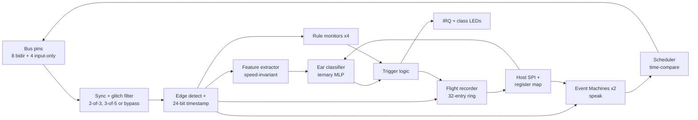

# Shruti — Event-Native Protocol Emulator ASIC: Architecture Spec v1.0

Gautam Ramachandra · 23 September 2026 · v1.0 · Jane Street protocol emulator ASIC competition (Tiny Tapeout, IHP 130nm CMOS5L)

## What Shruti is

Shruti (Sanskrit: "that which is heard") is a protocol emulator ASIC that also listens. Two event-native engines speak UART, SPI and I2C from firmware, with low-speed USB and Manchester transmit as stretch goals. An on-die classifier, the Ear, identifies an unknown bus from its edge timing alone and flags traffic that fits nothing it knows.

One hardware event stream (pin edges with 20 ns timestamps) feeds three consumers: firmware that speaks, rule monitors that check, and a learned model that identifies. That shared substrate is the design's one idea; everything else is sized around the memory it needs.

What is hard to copy is not the RTL, which the rules make open. It is the closed loop: the chip captures features of a new bus, the open-source pipeline trains a ternary classifier on the host, the weights load back into silicon, and a formal proof shows the on-die inference is bit-exact to the trained model. That loop needs hardware/ML co-design, edge quantization, waveform classification and verification skill in one team. Establish priority by building in public from day one, with a dated repo and a short write-up.

## Competition alignment

Every stated requirement in the [Jane Street brief](https://blog.janestreet.com/protocol-emulator-asic-competition/) maps to a concrete block; the Ear is the answer to "show us anything else your architecture makes possible".

| Brief requirement | How Shruti meets it |
| --- | --- |
| Tiny CPU with an ISA for reading pins, writing pins, counting cycles, exact timing | Two Event Machines (EMs); every instruction is anchored to a captured edge timestamp, so timing is set by hardware, not by instruction latency |
| Reprogrammable for new protocols after fabrication | EM firmware is host-loaded (32 x 16-bit words per EM); the Ear's weights are host-loaded too, so the identifier is retrainable after tapeout |
| UART, SPI, I2C first | Firmware library with cocotb tests against bus models; FPGA-proven against a USB-UART adapter, SPI flash and an I2C sensor |
| Stretch: low-speed USB | 1.5 Mbit/s = 33 core cycles per bit at 50 MHz; NRZI and bit-stuffing in firmware, CRC5/CRC16 in a small shared hardware unit (optional, ~150 cells) |
| Stretch: 10 Mbit Ethernet | Transmit through a ~150-cell hardware Manchester serializer fed from the OSR, host supplying preamble and CRC32; receive is a further stretch on DDR edge capture; bit periods must be whole cycles, so a 40 or 60 MHz core clock (section 11) |
| JTAG, SWD, PS/2, CAN | Firmware, after the core three; CAN needs an external transceiver and a wait-with-timeout for arbitration |
| Test RTL on an FPGA before the ASIC flow | Tang Nano 20K prototype from week 6; same RTL, same firmware |
| Novel design and verification methodology | Proof-carrying firmware, every protocol program proven against its contract before it can be loaded (section 10); golden-model differential testing, formal proofs on the scheduler, and a bit-exact formal equivalence proof of the on-die classifier (section 9) |
| IHP 130nm CMOS5L, Tiny Tapeout template, 6x4 tiles | Budget in section 8 targets 60% utilisation of 24 tiles; an 8x4 grant adds a third EM or doubles program memory |
| Open source | Apache-2.0 for RTL, firmware, models and the training pipeline; public repo from day one |
| Teams recommended | Two roles: microarchitecture + physical design; ISA, toolchain, Ear, verification and write-up |
| Deadline 18 Jan 2027, March 2027 shuttle | Feature freeze 20 Dec 2026, submission 12 Jan 2027 (section 15) |

## Architecture overview

One event stream, three consumers: the Event Machines speak, the Ear listens, the monitors watch, and the flight recorder keeps the last 32 events for the host.



Edges enter on the left, get filtered and timestamped once, and fan out to every block; only the scheduler drives pins, and only the host loads programs and weights. Single clock domain at a 50 MHz target (24 MHz fallback), synchronous reset, all state in flip-flops unless the SRAM rule in section 8 fires.

## Event-native datapath and ISA

Every timing-critical instruction is anchored to T, a per-EM time register that hardware sets to the timestamp of the last matched edge, so the edge decides the timing and instruction latency never does. This is the honest answer to "what would you do differently from PIO": PIO counts delays from when an instruction runs; Shruti schedules from when the bus event happened. The lineage is the channel time latches of NXP's eTPU, credited openly.

Per-EM state: PC (5 bits), T (24 bits) with a T_PASSED bit, X and Y counters (16 bits each), a bit-period register P (16 bits), ISR and OSR shift registers (16 bits each, with 5-bit counters), a shift configuration register (bit order, word length and autopull/autopush threshold per direction), two scheduler slots (24-bit compare, pin, value), a 12-bit pin snapshot latched at the last matched edge, per-pin push-pull/open-drain mode, and the TO, LATE, OVF and UNF flags. Instructions are 16 bits: a 4-bit opcode and 12 bits of operands; 32 words per EM. The encoding table below is a summary; [isa/isa.yaml](../isa/isa.yaml) (v1.1) is normative, and [isa-decisions.md](isa-decisions.md) records why each choice was made.

| Op | Instruction | Operands (bits 11..0) | Behaviour |
| --- | --- | --- | --- |
| 0 | HALT | reserved | Stop, raise IRQ. Opcodes 12-15 and illegal operands also halt, so blank (all-zero) program memory halts |
| 1 | WAIT pin, mode [, 2^n] | pin 4, mode 3, timeout 5 | Block until rise, fall, any edge, high or low level; T := match cycle, snapshot latched. Timeout 2^n cycles after T (n = 1..23): TO := 1, T := deadline, continue |
| 2 | OUT pin, v @T+d | pin 4, value 2, d 6 | Arm a scheduler slot to drive pin at exactly T+d (d = 0..63). v = 0, 1, OSR (consumes exactly one bit) or ~OSR (next bit inverted, not consumed). Blocks only while both slots are busy |
| 3 | IN pin @T+d / IN pin @snap | pin 4, snap 1, d 6 | Block until T+d and sample the pin, or read the snapshot without blocking; the bit goes into the ISR |
| 4 | ADDT d [, now] | now 1, d 11 | T := T + d, or T := max(T, counter + d): the anchor never moves backwards |
| 5 | ADDT P[/2\|/4\|/8] [, now] | now 1, shift 2 | As ADDT with d = P >> shift, so firmware never hard-codes the bit rate |
| 6 | SHIFT out\|in, lsb\|msb, n [, auto] | dir 1, msb 1, auto 1, n-1 4 | Configuration only: bit order, word length n (1..16) and the autopull/autopush threshold |
| 7 | PUSH [block] | block 1 | ISR word (1 or 2 bytes) to RX FIFO; non-blocking on full drops it and sets OVF |
| 8 | PULL [block] | block 1 | TX FIFO to OSR (1 or 2 bytes); non-blocking on empty leaves the OSR unchanged |
| 9 | SET pin, v [, pp\|od] / SET X\|Y\|P, imm | target 2, then pin 4, level 1, od 1 or imm 10 | Immediate pin drive and mode, or register load (0..1023; the host writes all 16 bits of P) |
| 10 | JMP [cond,] target | cond 3, pin 4, target 5 | always, TO, LATE, TXE (TX FIFO empty), !OSRE (OSR not empty), X--!=0, Y--!=0, pin high, pin low on any of the 12 pins |
| 11 | SYNC set\|wait, n | op 1, flag 2 | Four flags shared by the EMs and the host; wait blocks until the flag is set, then clears it |

Timing model: one cycle per instruction unless it blocks; all time comparisons are modulo 2^24, and a time t is in the future iff (t - counter) mod 2^24 is in [1, 2^23). An OUT@ whose target is not in the future, or an IN@ whose target has passed, still executes but sets the sticky LATE flag; LATE is visible to JMP and to the host, and every firmware contract requires that it is never set. Inputs are seen through the synchroniser, L = 2 cycles late, so a program that runs ahead of its own scheduled outputs should wait on edges rather than levels: a level WAIT can match the pin's old level before a scheduled change becomes visible. At reset T equals the counter, X, Y and P are 0, and CFG is LSB-first with 8-bit words; the host may write P and CFG before starting an EM. A bit period is one "ADDT P" step up to 65,535 cycles (763 baud at 50 MHz); slower rates load P with 1/k of the period and take k steps per bit (300 baud: P = 55,556, three steps).

UART transmit at bit period B (host sets P = B, TX pin push-pull) is twelve words. ISS-verified: the pin trace is cycle-exact for 256 random (byte, B) pairs with B from 8 to 65,535, back-to-back frames are exact down to B = 4, and B <= 2 sets LATE.

```
        SET   tx, 1              ; line idles high
        SHIFT out, lsb, 8        ; LSB first, 8 data bits
top:    PULL  block              ; next byte -> OSR
        ADDT  2, now             ; T := max(T, now + 2): never before the previous stop bit ends
        OUT   tx, 0 @T+0         ; start bit
bit:    ADDT  P                  ; T += B
        OUT   tx, OSR @T+0       ; data bit, consumes one OSR bit
        JMP   !OSRE, bit         ; 8 data bits
        ADDT  P
        OUT   tx, 1 @T+0         ; stop bit
        ADDT  P                  ; T = end of stop bit
        JMP   top
```

Back-to-back bytes start exactly at the end of the previous stop bit; after idle, the start bit follows 2 cycles after the PULL returns. The two scheduler slots throttle the loop so it never runs more than two edges ahead. The v1.0 example (`ADDT 0, now` then `OUT @T+0`) was late by construction, since the slot was armed for a cycle that had already passed; that case is now an ISS regression test.

Three things this gives that PIO does not: hardware WAIT with timeout (needed for CAN arbitration, I2C clock stretching and USB turnaround), deferred hardware sampling at a computed time (a mid-bit read is one instruction), and a snapshot of every pin at the edge so a slave can read data exactly at the clock edge. Measured on the ISS (fw/), the v1.0 claim that UART, SPI and I2C each fit in 12 words was wrong for everything but UART transmit: UART transmit is 12 words, UART receive 17, SPI master (mode 0) 19, and I2C master write (multi-byte, ACK check, clock stretching, STOP and bus-free time) exactly 32, with its bit order set by the host through EMx_CFG. So 32 words hold UART transmit plus receive (29) or SPI master plus UART transmit (31) in one EM, but I2C master fills an EM on its own; SPI slave (mode 0) is 18 words. Speed limits at 50 MHz, also measured: UART transmit B >= 4 cycles, UART receive B >= 9, SPI master SCK up to 5 MHz (P >= 5), SPI slave SCK phases of at least 4 cycles.

## The Ear: identifier and retraining loop

The Ear turns raw edge timing into 72 speed-invariant features in hardware, classifies them with a host-loaded ternary MLP, and reports a class, a confidence flag and an out-of-distribution flag. Its per-pin bit-period estimate gives the protocol's speed without any ML.

Speed invariance is the design insight: intervals are coded in the log2 domain (leading-one position plus two mantissa bits, 6 bits total), and the histogram bins each interval by its ratio to the shortest interval seen so far in the window (a running minimum; the histogram shifts when a shorter interval arrives). A 9600-baud UART and a 1-Mbaud UART then produce the same interval histogram, exactly for power-of-two speed ratios and to within a half-octave bin otherwise, which is what lets a model this small generalise; the shortest-interval code and the edge counts still carry the absolute speed (the v1.0 text claimed the whole feature vector was the same, which it is not). The bit-exact definition is ear/SPEC.md.

| Feature group (4 monitored pins, host-selected) | Per pin or pair | Bits | What it separates |
| --- | --- | --- | --- |
| Interval-ratio histogram, 8 bins (1x, 1.4x, 2x, 2.8x, 4x, 5.7x, 8x, 11x+) | 8 x 6-bit counters | 48 | UART frames vs SPI clock vs Manchester (only 1x and 2x) |
| Shortest interval code (bit period), longest in-burst interval code | 2 x 6 bits | 12 | Speed estimate; CAN (max run 5) vs USB (max run 6) vs UART (up to 9) |
| Edge count and time-high fraction in the window | 2 x 8 bits | 16 | Idle polarity, clock lines (50% duty), activity |
| Pair: b-edges within 4 cycles of an a-edge | 12 pairs x 6 bits | 72 | Differential pairs (USB D+/D-), data-follows-clock |
| Pair: b-edges while a is high | 12 pairs x 6 bits | 72 | I2C (SDA changes only while SCL low, except START/STOP) vs SPI modes |

A window closes after 256 edges or 65,536 cycles, whichever comes first; the features are snapshotted and the counters restart. Inference is a serial multiply-accumulate: one ternary weight per cycle into a single 16-bit accumulator (add, subtract or skip), ReLU and a host-set right shift to 8 bits as each hidden unit completes, then an 8-way output layer. 72 x 8 + 8 x 8 = 640 weights at 2 bits = 1,280 bits, so a full pass takes 640 cycles plus 8 for the argmax, 648 cycles or 13 us at 50 MHz (the v1.0 text said one feature per cycle with 8 accumulators, which contradicts its own ~700-cycle figure and would need 8 adders). Class = argmax; confident = (best - second best) above a host-set margin; OOD = best logit below a host-set floor, plus an activity gate. OOD is the weakest link and is validated empirically (section 9), not assumed.

The retraining loop is what makes the Ear reprogrammable after fabrication, and it is the part competitors will not have:

1. Capture: with the chip watching the new bus, the host reads feature snapshots (72 bytes each) across several speeds and devices; the user supplies the label. A few hundred snapshots per class is enough.
2. Train: PyTorch, quantisation-aware training with ternary weights and integer thresholds; features are 8-bit. The same pipeline bootstraps the first model from a protocol simulator that emits edge streams with jitter and glitches, before any hardware exists.
3. Verify: a bit-exact Python reference and the RTL (cocotb) run the same snapshots and must produce identical logits; the formal datapath proof in section 9 covers every weight set once.
4. Load: the host writes 1,280 bits over SPI at boot, in under a millisecond.

Shipped as a CLI, `shruti teach`, `shruti train`, `shruti load`, this is the demo: teach the chip an undocumented bus in minutes, with no re-spin.

## Watch: rule monitors, anomaly trigger, flight recorder

Watch is a hardware protocol trigger with a 32-event pre-trigger memory, the thing a logic analyser does, driven by rules the user writes and by anomalies the Ear learns. It observes only; nothing in Shruti alters the bus.

Four rule monitors, each host-configured: an edge to match (pin, rise, fall or any), a guard over the 12-pin snapshot (mask and value, so "edge on A while B high and C low"), optional bounds on the interval since that pin's previous edge (two 6-bit log codes), and an action: count, trigger, halt the EMs, or set a SYNC flag. Examples: SPI data edge within one cycle after the sampling clock edge (setup violation); UART pulse shorter than half a bit period (glitch or baud mismatch); USB single-ended zero longer than two bit times (reset).

Trigger sources: any rule, the Ear's OOD flag, an Ear class change, the host, or the external trigger-in pin. On trigger the recorder keeps N more events (host-set, 0 to 31) and freezes, raises IRQ, drives trigger-out so a scope can capture the same moment, and optionally halts the EMs. The recorder holds 32 entries of 21 bits: 16 low timestamp bits, 4-bit pin, 1-bit edge, read out over SPI.

Rules and the learned model are complementary on purpose: rules catch the violation you can name, the Ear catches the traffic you cannot, and both land the raw edges in the same buffer.

## I/O plan and host interface

Twelve watchable bus pins, a 3-wire host SPI, and five status outputs use all 24 Tiny Tapeout signals; the demo board's own RP2040 is the host, so the demo needs no extra hardware.

| Signal | Use |
| --- | --- |
| uio[7:0] | Bus pins B0-B7, bidirectional. Per-pin push-pull or open-drain mode (OUT value 1 releases the pin), which is how I2C and 1-Wire drive without extra logic |
| ui_in[0..2] | Host SPI: SCK, MOSI, CS_n (mode 0, up to core clock / 4 = 12.5 MHz) |
| ui_in[3] | Trigger-in from a scope or another Shruti |
| ui_in[4..7] | Monitor-only bus pins M0-M3; EMs can WAIT and IN on them, the Ear and monitors can watch them |
| uo_out[0] | Host SPI MISO |
| uo_out[1..2] | IRQ, trigger-out |
| uo_out[3] | Ear confident flag |
| uo_out[4..6] | Ear class, 3 bits, straight to the demo board LEDs |
| uo_out[7] | Ear OOD flag |

Register map over SPI (8-bit command, 8-bit address, data): PROG0 and PROG1 (32 x 16 bits each), WEIGHTS (1,280 bits), FEATURES (72 bytes, read), RECORDER (32 x 21 bits, read), MON0-3 config, EAR config (4-pin select, margin, floor, window length), EM control (run, halt, reset, PC), EMx_P bit period and EMx_CFG shift configuration, TX and RX FIFOs (4 deep per EM), STATUS (including the sticky LATE, OVF and UNF flags per EM). Every bit of program, weights and configuration is host-loaded; nothing protocol-specific is fixed in silicon.

Electrical: logic levels are whatever the Tiny Tapeout board provides (confirm 3.3 V in week one). I2C uses open-drain mode with external pull-ups; low-speed USB needs the external 1.5 kohm pull-up on D- and a level check, proven on the FPGA before it is claimed.

## Memory-first area budget

The design holds about 5,000 bits of state (the table's sum; v1.0 of this text said 5,400) and an estimated 10,900 cells (10,700 without the two Ethernet stretch blocks), against roughly 14,400 usable cells (24 tiles at ~1,000 cells per tile, 60% utilisation for routing and clock tree). That leaves ~24% headroom before the first synthesis run; estimates are pre-synthesis and carry +/-30%, so weekly measured numbers replace them from week five.

| Block | State bits | Est. cells | Note / cut option |
| --- | --- | --- | --- |
| EM program memory, 2 x 32 x 16 | 1,024 | 1,600 | Flops plus 32:1 read mux; cut: share one 32-word memory between EMs |
| Event Machines x2 (registers, decode, shifters, 3 comparators each) | ~400 | 2,400 | Cut: single EM |
| ISA v1.1 additions x2 (P, CFG, T_PASSED, LATE/OVF/UNF, P >> s mux, ADDT-now compare) | ~66 | 300 | Cut: drop the P/4 and P/8 forms |
| Scheduler pin drive, open-drain modes | ~30 | 200 | |
| Pin sync, per-pin glitch filters (bypass, 2-of-3 or 3-of-5 majority; 3-of-5 rejects pulses under 60 ns and suits buses up to a few MHz), edge detect, 24-bit timestamp | ~230 | 400 | |
| Host FIFOs, 4 deep x 8 bits, TX and RX per EM | 128 | 250 | |
| Host SPI, register map, read mux | ~60 | 800 | |
| Feature extractor, 4 pins + 12 pairs | ~600 | 1,200 | Cut: 3 pins, 6 pairs |
| Ear classifier: weights as a shift chain, one 16-bit accumulator, 8 hidden bytes, 8 12-bit logits, argmax | ~1,500 | 2,200 | No feature snapshot: counters pause 648 cycles during inference. Cut: hidden layer 8 to 6 |
| Rule monitors x4 | ~210 | 400 | Cut: 2 monitors |
| Flight recorder, 32 x 21 bits as a shift ring | 672 | 800 | Shift-out readout avoids a read mux. Cut: 16 entries |
| CRC5/CRC16 unit (USB), optional | 16 | 150 | Drop if USB is not attempted |
| Manchester serializer (Ethernet transmit): divider, XOR, differential drive | ~24 | 150 | Stretch (section 11); first on the cut list |
| DDR edge capture, 12 pins (10 ns timestamps) | ~48 | 60 | Stretch; half-cycle paths need explicit timing constraints |
| **Total** | **~5,000** | **10,900** | 14,400 usable at 6x4; ~18,000 at 8x4 |

SRAM decision rule: use one SRAM macro for program, weights and recorder only if a single macro of at least 4 kbit fits in 3 tiles or fewer including its keep-out, checked against the CMOS5L template and the ttihp0p2 SRAM example in week one. Otherwise stay with flip-flops: a first tapeout with no macro carries no LEF, timing-model or placement risk, and the budget above already fits without one.

If the 8x4 grant arrives: add a third EM (2,400 cells) or double program memory to 64 words per EM (1,600 cells), not both, and keep utilisation under 65%.

## Verification methodology

The distinctive claim is a bit-exact formal proof that the on-die classifier computes what the trained model computes, for every weight set, on top of a conventional golden-model, formal and protocol-level stack; every method's bug count is reported in the write-up, including the AI-assisted one.

1. Golden models first. A cycle-accurate Python ISS for the EMs, with assembler and disassembler round-trip tests, is written before any RTL and is what the firmware library is developed on. The feature extractor and classifier have one bit-exact fixed-point reference shared with the training pipeline's export step.
2. Differential testing. Constrained-random EM programs (valid targets, reachable waits) run on the RTL in cocotb and on the ISS with the same random pin stimulus; pin drives, T values and FIFO contents must match cycle-exactly. Random edge streams do the same for the feature extractor.
3. Protocol level. cocotb bus models for UART, SPI and I2C exercise the real firmware; mutation tests (missing ACK, bad stop bit, injected glitches, clock stretching) must fire the right monitor or trigger.
4. Formal, with SymbiYosys. Scheduler: an armed slot fires at exactly its compare time, never earlier, never twice. Capture: no edge on a filtered pin is lost while an EM waits on it. FIFOs: no silent overflow or underflow. Recorder: after a trigger, exactly N more entries, then frozen. PC always in range; illegal opcode halts.
5. Formal, the classifier. A k-induction invariant over the MAC cycle counter shows each accumulator equals the running dot product of features and ternary weights as specified, for all weights and features; the argmax and threshold logic is proven equivalent to the reference by SAT. The datapath is small enough that this closes; each new weight set then needs only the differential run.
6. ML validation. Held-out captures from the FPGA, at least five devices per class across speeds, give a confusion matrix. OOD is tested by training without JTAG and PS/2 and reporting the flag rate on them against the false-alarm rate on known classes. Glitch and speed-extreme robustness are reported too.
7. AI-assisted, measured. An LLM red team proposes mutation scenarios and candidate formal properties from the ISA spec; every property is human-reviewed before it counts. The same harness validates LLM-written firmware for a protocol it was not shown, which is the second demo. The report carries a bugs-found-per-method table.
8. Physical. Gate-level simulation of the key tests after place-and-route, timing signoff at 50 MHz, and a 24-hour FPGA loopback soak on real devices.

Traceability: each ISA line maps to an ISS routine, a formal property and a test in a matrix in the repo, and GitHub Actions runs the whole stack on every push, alongside the Tiny Tapeout GDS action. The RTL language is decided in section 12; either way the ISS is the single source of truth and the prover in section 10 sits on top of it.

## Proof-carrying firmware

Every program in the firmware library ships with a machine-checked proof that it meets its protocol contract, produced by `shruti prove` in seconds, and `shruti load` refuses an unproven program unless forced. Nobody proves PIO programs; Shruti's are small enough to prove, and that is the methodology claim the write-up leads with. Silicon cost: zero.

A contract is a short declaration over the pin trace. Per pin, an expected run of intervals as multiples of a symbolic bit period B (tolerance 0 cycles for generated timing, +/-k cycles for sampled timing); invariants such as "no SDA edge while SCL is high except START and STOP" or "data stable for at least s cycles before the sampling edge"; and response bounds such as "replies within N x B of the last input edge". Contracts for UART, SPI, I2C, PS/2 and low-speed USB framing live in the repo beside the programs.

Method: symbolic execution of the ISS. A program is at most 32 words, its loops are bounded by the X and Y counters, and its timing is arithmetic on T, so with the data bytes and B left symbolic the executor produces the pin trace as symbolic edge times and Z3 decides the contract (linear integer arithmetic for timing, bit-vectors for data). The UART transmit contract over all 256 bytes and every B from 8 to 65,535 cycles closes in about 0.5 s (prover v0, two symbolic frames with symbolic arrival times), and broken variants return counterexamples that the concrete ISS reproduces. An induction proof over the loop head then extends it to any number of frames: the base case and the step together take about 0.2 s. Reactive programs (slave, receive) are checked against a symbolic input trace constrained by the peer's contract.

Chain of trust, stated in the write-up exactly like this: the RTL matches the ISS by bounded formal equivalence of the Event Machine against a Verilog transliteration of the ISS semantics (SymbiYosys, depth at least the longest instruction) plus constrained-random differential testing; the ISS running the program satisfies the contract by Z3. That is a proof at the ISS level with the RTL bounded-equivalent and tested, not "fully verified silicon", and it is still stronger than anything a PIO program has.

What it buys in the competition: an LLM writes the firmware for a protocol it was never shown, the prover accepts or rejects it, and the accepted program loads with no human code review. That is the AI-assisted design loop the brief describes, closed. Milestones: UART transmit contract proven by 25 Oct; SPI and I2C by 29 Nov; the "LLM writes PS/2, prover accepts" demo by 20 Dec.

## Ethernet stretch: Manchester serializer and DDR capture

10BASE-T transmit is a ~150-cell hardware serializer, not firmware; receive is a further stretch on DDR edge capture. Almost no entry will attempt the brief's second stretch goal, and the demo is unambiguous: a switch's link LED comes on, then tcpdump on a laptop shows a frame sent by a 0.7 mm2 chip.

Transmit: an Event Machine cannot issue an instruction per half-bit at 10 Mbit/s, so Ethernet mode routes the OSR through a Manchester serializer: a programmable divider makes the bit clock, each bit is XORed with it to give the mid-bit transition, and the result drives two bus pins as TX+ and TX-. The host supplies preamble, frame and CRC32; the EM only pulls bytes, and the serializer auto-pulls from the OSR. Link: the EM emits a 100 ns normal link pulse every 16 ms with one scheduled OUT pair, which is what lights the LED.

Clock: a bit period must be a whole number of cycles. At 50 MHz a half-bit is 2.5 cycles, so Ethernet means a 40 MHz core (4 cycles per bit) or 60 MHz (6 cycles per bit); the week-one clock measurement decides, and every timestamp figure in this spec scales with it. 10BASE-T needs +/-100 ppm, which the demo board's crystal-derived clock meets.

Electrical: 3.3 V pins through series resistors into a MagJack transformer, as bit-banged 10BASE-T from microcontroller GPIOs has shown to work; proven on the FPGA before it is claimed, never on silicon first.

Receive: DDR capture samples each pin on both clock edges (two flops and a mux per pin, ~60 cells for 12 pins), giving 10 ns timestamps at 50 MHz. Manchester decode then runs in firmware from the timestamp stream or in a ~150-cell hardware decoder. DDR capture also doubles timing resolution for the Ear and Watch, so it earns its place even if receive never ships; its half-cycle paths need explicit constraints in the flow. Both blocks sit at the top of the cut list.

## Toolchain decision: Hardcaml or Verilog

Decide at the partner meeting on 11 Oct: RTL in Hardcaml if the RTL owner will work in OCaml, otherwise Verilog. The ISS, assembler, prover and Ear pipeline stay in Python either way, and the ISS is the single source of truth: instruction encodings are generated from one table for the ISS, the assembler and the RTL, so the two languages cannot drift.

Why Hardcaml: the judges built it. hardcaml_waveterm expect tests (the ASCII waveforms featured on their blog) and hardcaml_verify (SAT-based bounded checks) are the tools they read fluently, and Hardcaml generates the Verilog the Tiny Tapeout flow needs, so nothing changes downstream. An entry written in their language and tested in their idiom will be read more carefully than one that is not.

Cost and risk: two to three weeks of OCaml ramp for the RTL owner on a design this size; cocotb protocol tests then run on the generated Verilog, and the formal suite runs on it too. If Verilog: the Yosys-synthesisable SystemVerilog subset, cocotb and SymbiYosys, which is fully adequate and only loses the fit bonus. Do not split the difference; one language for all RTL.

## The demo

One five-minute video, recorded on the FPGA prototype in December and re-shot on silicon if chips come back, is the submission's centrepiece; the write-up and the repo exist to back it up. The sequence:

1. Clip the chip onto an undocumented bus: the internal I2C of a cheap consumer device, or a UART console.
2. The Ear's LEDs show the class and the speed register shows the bit period.
3. A Watch rule triggers and the flight recorder dumps the frames.
4. An LLM is handed the datasheet (or the captured frames) and writes the firmware.
5. `shruti prove` accepts it. If a first attempt was rejected, show that too; judges trust a counterexample more than a green tick.
6. `shruti load`, the chip talks to the device, the host shows the data.
7. Ethernet: the switch link LED comes on, then tcpdump shows the frame.
8. Thirty seconds of fuzzing: mutated frames against the device, response latencies read at 20 ns.

Deliverables in the submission: the video, the README pitch, this spec, and a verification report whose centre is a bugs-found-per-method table, including where the LLM red team failed.

## Risks and cut list

The two risks that decide the outcome are area after synthesis and the Ear generalising to real hardware; both have a fallback that still yields a valid submission.

| Risk | Early signal | Response |
| --- | --- | --- |
| Area overrun after synthesis (+20-30% over estimate is normal) | Week-5 yosys cell count above 13,000 | Apply the cut list below, in order |
| Timing does not close at 50 MHz | Post-route slack negative in week 13 | Run at 24 MHz: USB becomes 16 cycles per bit, still workable; Manchester transmit is dropped |
| Ear misclassifies real devices | Confusion matrix below 90% on FPGA captures | Fine-tune on FPGA captures; if still weak, ship the Ear as beta and keep features plus bit-period reporting, which are useful alone |
| OOD flag noisy | False alarms above 5% on known classes | Raise the floor, label it "unknown" rather than "anomaly", publish the rate |
| CMOS5L template or flow problems (new branch) | Counter does not reach GDS in week 1 | Email asic-competition@janestreet.com and the Tiny Tapeout Discord in week 1, not week 10 |
| No partner by 11 Oct | | Single-EM scope, no USB, Ear kept |
| Electrical unknowns on the demo board (open-drain, USB pull-ups) | | Prove on the FPGA; claim only what ran |
| Time, alongside the day job and other ventures | A missed checkpoint | Cut scope at the checkpoint, never the timeline |

Cut order, cheapest first: 1. Manchester serializer and DDR capture. 2. CRC unit. 3. Monitors 4 to 2. 4. Recorder 32 to 16 entries. 5. Ear to 3 pins, 6 pairs, hidden layer 6. 6. One shared 32-word program memory. 7. Single EM. 8. Drop the Ear; the EM, monitors and recorder are still a complete, novel entry. Never cut: the ISS, the prover, the verification stack, the FPGA proof.

## Milestones to the deadline

Submission is targeted for 12 Jan 2027, six days before the 18 Jan 2027 deadline, with a feature freeze on 20 Dec 2026; the ISS and firmware come before any RTL so the ISA is proven cheap.

| Date | Milestone | Owner | Status |
| --- | --- | --- | --- |
| 4 Oct 2026 | Counter through the CMOS5L template to GDS; logic level, SRAM macro and I/O speed questions answered; Tang Nano 20K and test devices ordered | Gautam | Tiles checked: the CMOS5L precheck tables list 6x4 and 8x4. First CI runs on main failed before any step ran; not yet diagnosed |
| 11 Oct 2026 | Partner decision; Hardcaml or Verilog decided; core clock chosen (40, 50 or 60 MHz); ISA v1 frozen (this doc) | Gautam | ISA v1.1 reconciled (docs/isa-decisions.md); freeze pending |
| 25 Oct 2026 | ISS, assembler and disassembler; UART, SPI and I2C firmware passing on the ISS; protocol simulator emitting edge streams for training; shruti prove v0 proves the UART transmit contract with symbolic data and bit period | Gautam | ISS, assembler and firmware (UART TX/RX, SPI master, I2C master) done and tested on the ISS; shruti prove v0 proves the UART TX contract for P = 8..65,535, all bytes and arrival times, in about 0.5 s; protocol simulator pending |
| 8 Nov 2026 | EM0 RTL passes differential tests against the ISS; first measured synthesis cell count | Partner |  |
| 15 Nov 2026 | Feature extractor RTL with bit-exact reference; first Ear model trained on synthetic data, weights loading over SPI | Gautam |  |
| 29 Nov 2026 | Checkpoint: both EMs, host SPI, monitors, recorder and Ear integrated; UART, SPI and I2C pass protocol tests and their contracts are proven; cell count under 13,000 or the cut list applies | Both |  |
| 6 Dec 2026 | FPGA bring-up against a USB-UART adapter, SPI flash and I2C sensor; capture dataset started; Ethernet link pulses light a switch LED if the serializer is in | Partner |  |
| 13 Dec 2026 | Formal suite closes, classifier proof included; Ear fine-tuned on FPGA captures; confusion matrix and OOD numbers recorded | Gautam |  |
| 20 Dec 2026 | Feature freeze; low-speed USB, Ethernet frame transmit and the LLM-written, prover-accepted PS/2 firmware demo count only if already passing | Both |  |
| 4 Jan 2027 | Place-and-route, timing signoff at 50 MHz, gate-level simulation of key tests | Partner |  |
| 12 Jan 2027 | Submission: README, ISA reference, verification report with bugs-per-method table, demo video | Gautam |  |
| 18 Jan 2027 | Jane Street deadline (buffer) | |  |

## Open questions for week one

Eight facts this spec assumes but has not verified; each changes a number above, so they come before any RTL.

- [ ] Maximum core clock and pin toggle rate on the CMOS5L Tiny Tapeout board: decides 50 MHz vs 24 MHz and whether low-speed USB is claimable
- [ ] Logic level of the board's I/O (assumed 3.3 V) and whether uio pins can be tri-stated per pin at runtime, which open-drain mode needs
- [ ] SRAM macro sizes and area on CMOS5L, from the template and the ttihp0p2 SRAM example: feeds the SRAM rule in section 8
- [ ] Whether the 8x4 tile option is confirmed, and by when: decides the third EM vs 64-word memory choice
- [ ] Which flow version the cmos5l template branch runs (LibreLane or OpenLane) and whether the GDS GitHub Action works on a fork today
- [ ] Partner: who owns microarchitecture and physical design, whether they will write it in Hardcaml, and by 11 Oct
- [ ] Final 8 Ear classes: UART, SPI, I2C, low-speed USB, CAN, JTAG/SWD, PS/2, Manchester, or swap CAN for 1-Wire
- [ ] Name and licence: check "Shruti" for collisions with existing chips or tools; Apache-2.0 for everything, or CERN-OHL-P for the RTL

One decision with no research needed: publish a short write-up of the architecture at ISA freeze on 11 Oct to establish priority, not after the FPGA works.
